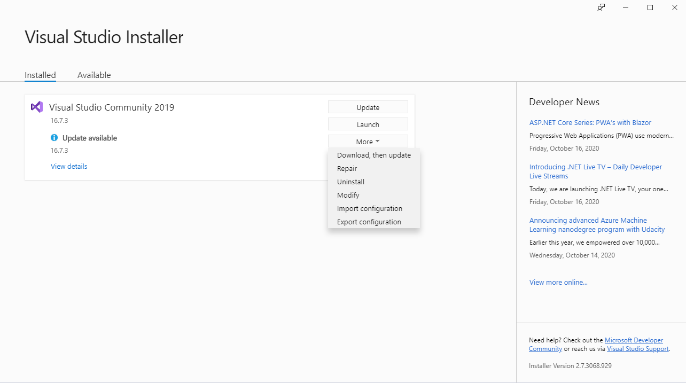
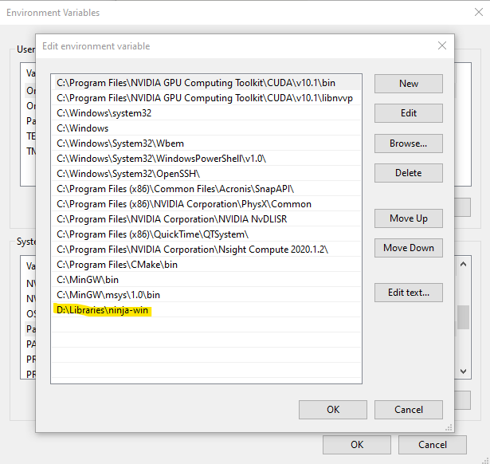
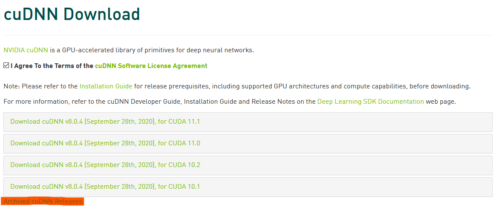
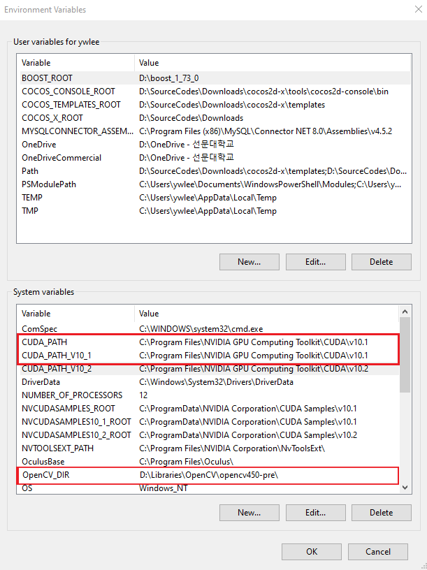
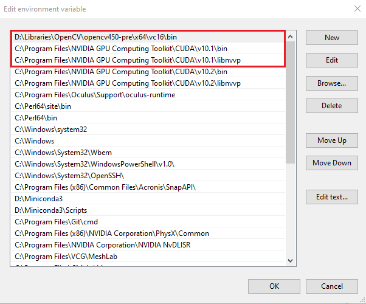

# FaceAndLicenceDetection

---

- 사전 준비 사항
    - Visual Studio 2019
        - [https://visualstudio.microsoft.com/ko/](https://visualstudio.microsoft.com/ko/)
        - .vsconfig 파일 생성

            ```scheme
            {
            "version": "1.0",
            "components": [
            "Microsoft.VisualStudio.Component.CoreEditor",
            "Microsoft.VisualStudio.Workload.CoreEditor",
            "Microsoft.NetCore.Component.Runtime.3.1",
            "Microsoft.NetCore.Component.SDK",
            "Microsoft.VisualStudio.Component.NuGet",
            "Microsoft.Net.Component.4.6.1.TargetingPack",
            "Microsoft.VisualStudio.Component.Roslyn.Compiler",
            "Microsoft.VisualStudio.Component.Roslyn.LanguageServices",
            "Microsoft.VisualStudio.Component.FSharp",
            "Microsoft.NetCore.Component.DevelopmentTools",
            "Microsoft.VisualStudio.ComponentGroup.WebToolsExtensions",
            "Microsoft.Net.Component.4.8.SDK",
            "Microsoft.Net.Component.4.7.2.TargetingPack",
            "Microsoft.Net.ComponentGroup.DevelopmentPrerequisites",
            "Microsoft.Component.MSBuild",
            "Microsoft.VisualStudio.Component.TextTemplating",
            "Microsoft.VisualStudio.Component.SQL.CLR",
            "Microsoft.VisualStudio.Component.ManagedDesktop.Core",
            "Microsoft.Net.Component.4.5.2.TargetingPack",
            "Microsoft.Net.Component.4.5.TargetingPack",
            "Microsoft.VisualStudio.Component.IntelliCode",
            "Microsoft.Net.Component.4.TargetingPack",
            "Microsoft.Net.Component.4.5.1.TargetingPack",
            "Microsoft.Net.Component.4.6.TargetingPack",
            "Microsoft.Net.ComponentGroup.TargetingPacks.Common",
            "Microsoft.Net.Core.Component.SDK.2.1",
            "Microsoft.VisualStudio.Component.DiagnosticTools",
            "Microsoft.VisualStudio.Component.EntityFramework",
            "Component.Microsoft.VisualStudio.LiveShare",
            "Microsoft.VisualStudio.Component.VC.CoreIde",
            "Microsoft.VisualStudio.Component.VC.Tools.x86.x64",
            "Microsoft.VisualStudio.Component.Graphics.Tools",
            "Microsoft.VisualStudio.Component.VC.DiagnosticTools",
            "Microsoft.VisualStudio.Component.Windows10SDK.18362",
            "Microsoft.VisualStudio.Component.ManagedDesktop.Prerequisites",
            "Microsoft.ComponentGroup.Blend",
            "Microsoft.VisualStudio.Component.Debugger.JustInTime",
            "Microsoft.VisualStudio.Workload.ManagedDesktop",
            "Microsoft.VisualStudio.Component.VC.Redist.14.Latest",
            "Microsoft.VisualStudio.ComponentGroup.NativeDesktop.Core",
            "Microsoft.VisualStudio.ComponentGroup.WebToolsExtensions.CMake",
            "Microsoft.VisualStudio.Component.VC.CMake.Project",
            "Microsoft.VisualStudio.Component.VC.ATL",
            "Microsoft.VisualStudio.Component.VC.TestAdapterForBoostTest",
            "Microsoft.VisualStudio.Component.VC.TestAdapterForGoogleTest",
            "Microsoft.VisualStudio.Component.VC.ASAN",
            "Microsoft.VisualStudio.Component.VC.v141.x86.x64",
            "Microsoft.VisualStudio.Workload.NativeDesktop",
            "Microsoft.VisualStudio.Component.Windows10SDK.19041",
            "Component.MDD.Linux",
            "Component.Linux.CMake",
            "Component.MDD.Linux.GCC.arm",
            "Microsoft.VisualStudio.Workload.NativeCrossPlat",
            "Microsoft.VisualStudio.Component.VC.v141.ATL"
            ]
            }
            ```

        - Visual Studio Installer - More - Import configuration

            

        - .vsconfig 파일 불러오기

            

    - CMake 3.17.2
        - [https://github.com/Kitware/CMake/releases](https://github.com/Kitware/CMake/releases)

    - Anaconda 3 / Miniconda 3
        - [https://www.anaconda.com/products/individual#windows](https://www.anaconda.com/products/individual#windows)
        - [https://docs.conda.io/en/latest/miniconda.html](https://docs.conda.io/en/latest/miniconda.html)

    - Ninja 1.10.1
        - [https://github.com/ninja-build/ninja/releases/tag/v1.10.1](https://github.com/ninja-build/ninja/releases/tag/v1.10.1)
        - zip 파일 다운로드 - 압축 해제 - ninja.exe 경로를 시스템 PATH 환경 변수에 추가

            

    - CUDA 10.1
        - [https://developer.nvidia.com/cuda-10.1-download-archive-base?target_os=Windows&target_arch=x86_64](https://developer.nvidia.com/cuda-10.1-download-archive-base?target_os=Windows&target_arch=x86_64)

            

    - cuDNN 8.0.3
        - [https://developer.nvidia.com/cudnn](https://developer.nvidia.com/cudnn)
        - Download cuDNN 버튼 선택 (로그인 창으로 이동 - 회원가입 필요)
        - Archived cuDNN Releases - 원하는 버전 선택 후 다운로드

            

            

        - 압축해제 후 bin, include, lib 폴더의 파일들을 설치 된 CUDA 경로에 복사

            

            압축 해제된 cuDNN 파일들

            

            설치된 CUDA 경로

    - Git
        - [https://git-scm.com/download/win](https://git-scm.com/download/win)

---

- OpenCV 빌드를 위한 가상 환경 생성
    - 시작 - Anaconda Prompt (anaconda 3)

        ```bash
        (base) C:\> conda create -n cvbuild python=3.7 numpy
        (base) C:\> conda activate cvbuild
        (cvbuild) C:\>
        ```

---

- OpenCV 빌드 및 설치 ( 4.5.0 )
    1. 오픈 소스 다운로드

        ```bash
        (cvbuild) C:\> git clone https://github.com/opencv/opencv.git
        (cvbuild) C:\> git clone https://github.com/opencv/opencv_contrib.git
        ```

    2. 컴파일러 세팅 : 

        ```bash
        (cvbuild) C:\> "C:\Program Files (x86)\Microsoft Visual Studio\2019\Community\VC\Auxiliary\Build\vcvars64.bat"
        ```

    3. cmd 에서 opencv 디렉터리로 이동, build 디렉터리 생성 후 이동

        ```bash
        (cvbuild) C:\opencv\> mkdir build && cd build
        ```

    4. cmake 구성 (Miniconda, opencv_contrib 경로를 알맞게 수정할 것)

        ```bash
        (cvbuild) C:\opencv\build> cmake \
        -G Ninja \
        -D CMAKE_BUILD_TYPE=RELEASE \
        -D ENABLE_FAST_MATH=ON \
        -D INSTALL_PYTHON_EXAMPLES=ON \
        -D INSTALL_C_EXAMPLES=OFF \
        -D OPENCV_ENABLE_NONFREE=ON \
        -D OPENCV_EXTRA_MODULES_PATH=..\..\opencv_contrib\modules \
        -D CMAKE_INSTALL_PREFIX=D:\Miniconda3\envs\cvbuild \
        -D PYTHON_EXECUTABLE=D:\Miniconda3\envs\cvbuild\python \
        -D PYTHON_INCLUDE_DIR=D:\Miniconda3\envs\cvbuild\include \
        -D PYTHON_PACKAGES_PATH=D:\Miniconda3\envs\cvbuild\Lib\site-packages \
        -D PYTHON_LIBRARY=D:\Miniconda3\envs\cvbuild\libs\python37.lib \
        -D BUILD_EXAMPLES=ON \
        -D WITH_CUDA=ON \
        -D WITH_CUDNN=ON \
        -D OPENCV_DNN_CUDA=ON \
        -D WITH_CUBLAS=1 ..
        ```

        

    5. 빌드 및 설치 ( 풀-코어 컴파일링 - 상당시간 소요 )

        ```bash
        (cvbuild) C:\opencv\build> ninja install
        ```

    6. 파이썬 테스트

        ```bash
        (cvbuild) C:\opencv\build> python
        >>> import cv2
        >>> cv2.__version__
        '4.5.6-pre'
        ```

    7. 윈도 환경 변수 추가 :

        

        : 시스템 변수 설정

        

        : Path - OpenCV, CUDA 경로 추가

---

- darknet 윈도우 버전 빌드
    1. Windows Powershell 실행
        - 다음과 같은 에러가 발생하는 경우

            

        - Powershell 을 관리자 권한으로 실행 후 다음을 입력

            ```bash
            PS C:\> set-executionpolicy unrestricted

            Execution Policy Change
            The execution policy helps protect you from scripts that you do not trust. Changing the execution policy might expose
            you to the security risks described in the about_Execution_Policies help topic at
            https:/go.microsoft.com/fwlink/?LinkID=135170. Do you want to change the execution policy?
            [Y] Yes [A] Yes to All [N] No [L] No to All [S] Suspend [?] Help (default is "N"):

            PS C:\> A
            ```

        - Powershell 재 실행 (일반 실행)

    2. vcpkg 설정 및 darknet 빌드

        ```bash
        PS C:\>              git clone https://github.com/microsoft/vcpkg
        PS C:\>              cd vcpkg
        PS C:\vcpkg>         $env:VCPKG_ROOT=$PWD
        PS C:\vcpkg>         .\bootstrap-vcpkg.bat
        PS C:\vcpkg>         .\vcpkg install darknet[cuda,cudnn]:x64-windows
        PS C:\vcpkg>         cd ..
        PS C:\>              git clone https://github.com/AlexeyAB/darknet
        PS C:\>              cd darknet
        PS C:\darknet>       .\build.ps1
        ```

    3. 커맨드 사용법
        - OpenCV 테스트

            ```bash
            darknet.exe imtest [이미지 경로]

            [ Example ]
            (ainet) C:\> darknet.exe imtest ..\data\images\Cars0.jp
            ```

            

            이미지가 나타날 경우 정상

        - 데이터 검증

            ```bash
            darknet.exe detector [train 또는 test] [.data 파일경로] [.cfg 파일경로] [.weight 파일경로] **-show_imgs**

            [ Example ]
            ****(ainet) C:\> darknet.exe detector train obj.data cfg\yolov3.cfg weights\yolov3.weights -show_imgs
            ```

            

            Augmentation 된 이미지들이 나타나고 바운딩 박스가 정상적으로 표시되는지 확인
            이미지들은 경로에 파일로 자동 저장됨

        - 학습

            ```bash
            darknet.exe detector [train 또는 test] [.data 파일경로] [.cfg 파일경로] [.weight 파일경로] **-옵션1 -옵션2 ...**

            [ Example: 새로 학습 ]
            ****(ainet) C:\> darknet.exe detector train obj.data cfg/yolov3_plate.cfg

            [ Example: 이어서 학습 ]
            ****(ainet) C:\> darknet.exe detector train obj.data cfg/yolov3_plate.cfg weights/yolov3_plate.weights

            [ Example: mAP 출력 옵션 ]
            (ainet) C:\> darknet.exe detector train obj.data cfg/yolov3_plate.cfg weights/yolov3_plate.weights -map
            ```

            

---

- 데이터셋 구성
    - 디렉토리 구조

        ```bash
        dataset_root
        ├── dataset_dir_1                     (데이터셋은 다수일 수 있음)
        │   ├── train                         (학습 이미지 폴더, 다수일 수 있음)
        │   │   ├── image_dir_1
        │   │   │       ├── image_name_1.jpg
        │   │   │       ├── image_name_2.jpg
        │   │   │       ├── image_name_..jpg  (.jpg, .txt, .xml 파일 모두 이름 동일할 것)
        │   │   │       ├── image_name_1.txt
        │   │   │       ├── image_name_2.txt
        │   │   │       └── image_name_..txt  (.txt 파일은 YOLO 레이블로 사용)
        │   │   ├── image_dir_2
        │   │   ├── image_dir_..
        │   │   └── annotations               
        │   │           ├── image_name_1.xml
        │   │           ├── image_name_2.xml
        │   │           └── image_name_..xml  (.xml 파일은 SSD 레이블로 사용)
        │   └── valid                         (검증 이미지 폴더, 다수일 수 있음)
        │       ├── image_dir_1
        │       ├── image_dir_2
        │       ├── ..
        │       └── annotations
        ├── dataset_dir_2
        │   ├── train
        │   │   ├── image_dir_1
        │   │   ├── image_dir_2
        │   │   ├── ..
        │   │   └── annotations
        │   └── valid
        │       ├── image_dir_1
        │       ├── image_dir_2
        │       ├── ..
        │       └── annotations
        └── dataset_dir_...
            ├── train
            │   ├── image_dir_1
            │   ├── image_dir_2
            │   ├── ..
            │   └── annotations
            └── valid
                ├── image_dir_1
                ├── image_dir_2
                ├── ..
                └── annotations
        ```

    - 레이블 데이터의 구성
        1. YOLO
            - 이미지 폴더 안에 .txt 포맷으로 함께 저장

                

            - .txt 파일 구조 :

                **[ 클래스 번호 ] [ x 좌표 ] [ y 좌표 ] [ 가로 크기] [ 세로 크기 ]**

                

        2. SSD
            - annotations 폴더 안에 .xml 포맷으로 저장
            - .xml 파일 구조 :

                

                [태그 값의 의미](https://www.notion.so/5a5995f074e7460aa3172085047aeee7)

    - YOLO 학습에 필요한 데이터

        [파일 종류 및 설명](https://www.notion.so/fedd768801534a7a9d72ddd53186c905)

        .obj

        ```bash
        classes = 2                                  (분류 클래스의 수)
        train = C:\train.txt                         (학습 이미지 경로 리스트 파일 위치)
        valid = C:\valid.txt                         (검증 이미지 경로 리스트 파일 위치)
        names = C:\obj.names                         (클래스 명 리스트 파일 위치)
        backup = C:\backup                           (.weights 파일 저장 경로)
        ```

        .cfg

        ```bash
        [net]
        batch=64                          (배치 크기)
        subdivisions=48                   (배치를 분할하는 크기, 8의 배수, =< batch)
        width=608                         (내부에서 처리되는 이미지 가로, 세로 크기)
        height=608
        channels=3                        (컬러 채널)
        momentum=0.949                    
        decay=0.0005                      
        angle=0
        saturation=1.5
        exposure=1.5
        hue=.1

        learning_rate=0.0013              (학습율)
        burn_in=1000
        max_batches=12000                 (최대 반복 수)
        policy=steps
        steps=9600,10800                  (학습율 감소 시점, [max_batches x 0.8], [max_batches x 0.9])
        scales=.1,.1

        mosaic=1

        **( 중간 생략.. 네트워크 구조 정의 부분 )**

        [convolutional]
        size=1
        stride=1
        pad=1
        filters=21                        (마지막 레이어, filters = (classes + 5) x 3)
        activation=linear

        [yolo]
        mask=6,7,8
        anchors=12, 16, 19, 36, 40, 28, 36, 75, 76, 55, 72, 146, 142, 110, 192, 243, 459, 401
        classes=2                         (분류 클래스 수)
        num=9
        jitter=.3
        ignore_thresh=.7
        truth_thresh=1
        random=1
        scale_x_y=1.05
        iou_thresh=0.213
        cls_normalizer=1.0
        iou_normalizer=0.07
        iou_loss=ciou
        nms_kind=greedynms
        beta_nms=0.6
        max_delta=5
        ```

        .txt

        ```bash
        [ train.txt : 학습 이미지 경로 리스트, 절대 경로 ]
        C:\dataset_root\dataset_dir\**train**\image_dir\image_name_1.jpg
        C:\dataset_root\dataset_dir\**train**\image_dir\image_name_2.jpg
        ..

        [ valid.txt : 검증 이미지 경로 리스트, 절대 경로 ]
        C:\dataset_root\dataset_dir\**valid**\image_dir\image_name_1.jpg
        C:\dataset_root\dataset_dir\**valid**\image_dir\image_name_2.jpg
        ..
        ```

        .names

        ```bash
        licence                           (index = 0)
        face                              (index = 1)
        ```

    - SSD 학습에 필요한 데이터

---

- SSD 학습
    1. OpenCV 빌드/설치한 가상환경을 복사

        ```bash
        (cvbuild) C:\> conda create -n ainet --clone cvbuild
        (cvbuild) C:\> conda activate ainet
        (ainet) C:\>
        ```

    2. 파이토치 설치

        ```bash
        (ainet) C:\> conda install pytorch=1.6 torchvision cudatookit=10.1 -c pytorch
        ```

    3. 소스 코드 다운로드

        ```bash
        (ainet) C:\> git clone https://github.com/ivpl-sm/FaceAndLicenceDetection.git
        (ainet) C:\> cd FaceAndLicenceDetection
        (ainet) C:\FaceAndLicenceDetection\>
        ```

    4. SSD 학습 데이터 생성

        ```bash
        (ainet) C:\FaceAndLicenceDetection\> cd SSD.PYTORCH
        (ainet) C:\..\SSD.PYTORCH\> python create_data_lists.py [dataset_dir_1] [dataset_dir_2] ..
        ```

        - [ dataset_dir_**N** ] 은 **데이터셋 구성 - 디렉토리 구조**에서 언급한 데이터셋 디렉토리의 절대 경로를 모두 입력

        - data.json 디렉토리 내 다음의 파일들이 생성 됨

            ```bash
            SSD.PYTORCH
            └── data.json
                ├── label_map.json
                ├── TEST_images.json
                ├── TEST_objects.json
                ├── TRAIN_images.json
                └── TRAIN_objects.json
            ```

        - 파이썬 소스 내에서 학습에 사용하기 위해 데이셋을 .json 포맷으로 재구성

        - 해당 파일들은 학습 루틴 내에서 자동화되어 사용

    5. 학습 방법

        ```bash
        [ 사용법 출력 ]
        (ainet) C:\..\SSD.PYTORCH\> python ssd_train.py -h
        usage: ssd_train.py [-h] [--data_folder DATA_FOLDER] [--checkpoint CHECKPOINT]
                        [--batch_size BATCH_SIZE] [--iterations ITERATIONS]
                        [--workers WORKERS] [--print_freq PRINT_FREQ] [--lr LR]
                        [--decay_lr_at DECAY_LR_AT] [--decay_lr_to DECAY_LR_TO]
                        [--momentum MOMENTUM] [--weight_decay WEIGHT_DECAY]

        [ Example: 기본 값으로 학습 ]
        (ainet) C:\..\SSD.PYTORCH\> python ssd_train.py

        [ Example: 파라미터 조정하여 학습 ]
        (ainet) C:\..\SSD.PYTORCH\> python ssd_train.py --arg1=value1 --arg2=value1 ..
        (ainet) C:\..\SSD.PYTORCH\> python ssd_train.py --checkpoint=ckpt/saved_checkpoint_1.pth --lr=10e-4
        ```

        [학습 파라미터 리스트](https://www.notion.so/4225e6f0227744b1a24a534ef1c4375f)

        - epoch 마다 ckpt 폴더 내 체크포인트 파일들이 생성됨

            ```bash
            SSD.PYTORCH
            └── ckpt
                ├── ckpoint_ssd300_0.pth
                ├── ckpoint_ssd300_1.pth
                └── ..
            ```

---

- 얼굴/번호판 추론 방법

    ```bash
    [ 사용법 출력 ]
    (ainet) C:\FaceAndLicenceDetection\> python prediction.py -h

    	usage: prediction.py [-h] -i INPUT -o OUTPUT [-d DISPLAY] [-c CONFIG] -w
    	                     WEIGHT [--confidence CONFIDENCE] [-t THRESHOLD]
    	                     [-u USE_GPU]

    [ Example: YOLO ]
    (ainet) C:\FaceAndLicenceDetection\> python prediction.py -c ckpt/yolov4_ainet.cfg -w ckpt/yolov4_ainet_best.weights -i video.mp4 -o result.avi

    [ Example: SSD ]
    (ainet) C:\FaceAndLicenceDetection\> python prediction.py -w ckpt/checkpoint_ssd300_285_best.pth -i video.mp4 -o result.avi
    ```

    [입력 파라미터 리스트](https://www.notion.so/3803b42dde824c93962e625769530481)

    - darknet 은 설정 파일과 가중치 파일이 분리되어 있으므로 -c , -w 파라미터 인자로 넘겨주지만 pytorch 는 단일 파일만 사용하므로 -w 파라미터 인자만 전달

    - 각 프레임워크 별 파일 확장자 컨벤션을 따를 것 (내부 코드에서 구분자로 활용)
        - darknet
            - 설정파일: .cfg
            - 가중치파일: .weights
        - pytorch
            - 체크포인트파일: .pth
        - tensorflow
            - 설정파일: .pbtxt
            - 가중치파일: .pb

---
