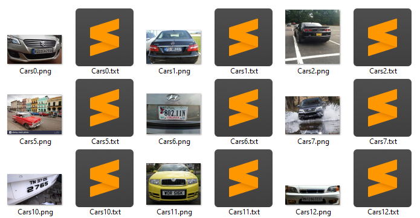
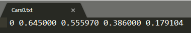
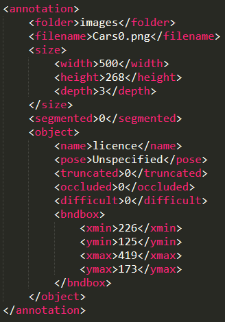
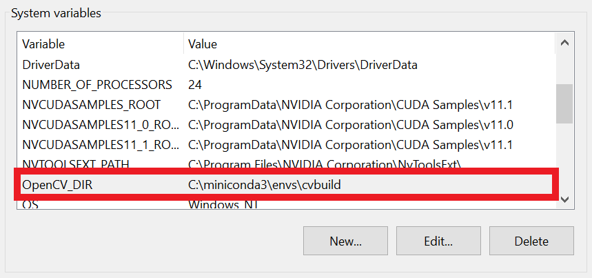
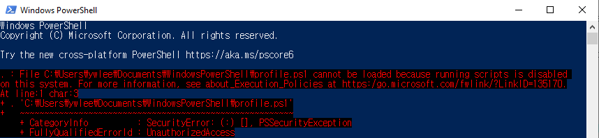
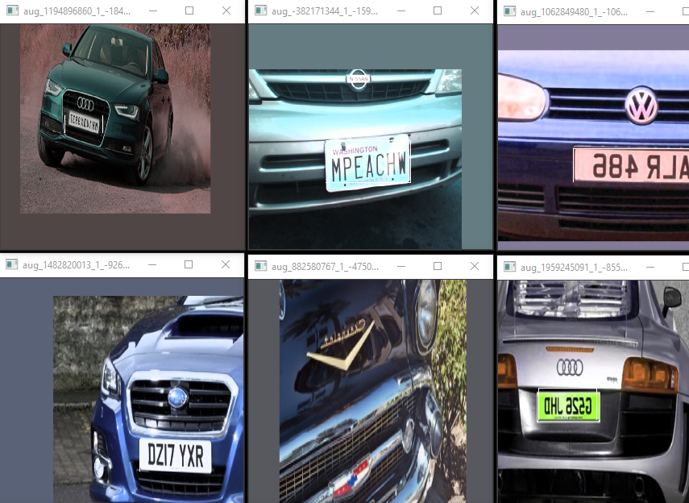
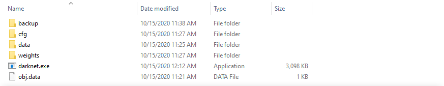

# FaceAndLicenceDetection

This repository contains individual training codes of SSD and Mask R-CNN models for object recognition of human faces and license plates. In addition, it includes the implementation of a technology that selects and loads one trained model from YOLO, SSD, and Mask R-CNN using OpenCV and detects and blurs a face or license plate from a video.

---

- __Pre-requisites__
    - Visual Studio 2019
    - CMake 3.17.2
    - Anaconda 3 / Miniconda 3
    - Ninja 1.10.1
    - CUDA 11.1
    - cuDNN 8.1.0

---

- __Environment__
    - CPU : AMD Ryzen™ 9 3900X
    - GPU : NVIDIA GeForce RTX 3090
    - OS : Windows 10

---

- __Preparing datasets__

    - Directory structure

        ```bash
        dataset_root
        ├── dataset_dir_1
        │   ├── train
        │   │   ├── image_dir_1
        │   │   │       ├── image_name_1.jpg
        │   │   │       ├── image_name_2.jpg
        │   │   │       ├── image_name_..jpg
        │   │   │       ├── image_name_1.txt
        │   │   │       ├── image_name_2.txt
        │   │   │       └── image_name_..txt
        │   │   ├── image_dir_2
        │   │   ├── image_dir_...
        │   │   └── annotations               
        │   │           ├── image_name_1.xml
        │   │           ├── image_name_2.xml
        │   │           └── image_name_..xml
        │   └── valid
        │       ├── image_dir_1
        │       ├── image_dir_2
        │       ├── ...
        │       └── annotations
        └── dataset_dir_...
        ```
    
    - Each `image_dir_N` directory has input images and `.txt` label files. These label files are used to train the YOLO.
      
    Also each `.txt` file has class and bounding box coordinates like `class id`, `start x`, `start y`, `width`, `height`  
    

    - `.xml` format label files are stored in the `annotations` directory. All information including the bounding box is classified by xml tags as follows. Label files in `.xml` format are used for training both SSD and Mask R-CNN.  
      

    - For YOLO training, files separated using extension convention such as `.data`, `.cfg`, `.txt`, `.names`, and `.weights` are required. As the name implies, `.weights` is the weight file of the pre-trained model, and `.cfg` is the file that defines the structure of the YOLO network and various hyper parameters.  
    ```bash
    # .data
    classes = 2                                  # number of classes
	train = C:\train.txt                         # path of training image list file
	valid = C:\valid.txt                         # path of validation image list file
	names = C:\obj.names                         # path of class name list file
	backup = C:\backup                           # path of saving weight file
    ```

    - `train.txt` and `valid.txt` referenced in `.data` store the list of absolute paths of the images as follows.
    ```bash
    C:\dataset_root\dataset_dir\train\image_dir\image_name_1.jpg
	C:\dataset_root\dataset_dir\train\image_dir\image_name_2.jpg
	...
    ```

    - In the file expressed as `obj.names` in `.data`, the names of each class are stored as a list.  
    ```bash
    # We use only 2 - classes
    licence                           # index = 0
    face                              # index = 1
    ```

---

- __Building of OpenCV__  
We utilize OpenCV `dnn` module for inference using the YOLO's pre-trained model at the Python level. From what we understand so far, for the `dnn` module to work properly on the GPU, you have to build it yourself.

    - Open anaconda prompt

        ```bash
        (base) C:\> conda create -n cvbuild python=3.7 numpy
        (base) C:\> conda activate cvbuild
        (cvbuild) C:\>
        ```

    - Download OpenCV source codes

        ```bash
        (cvbuild) C:\> git clone https://github.com/opencv/opencv.git
        (cvbuild) C:\> git clone https://github.com/opencv/opencv_contrib.git
        ```

    - Load MSVC toolset 

        ```bash
        (cvbuild) C:\> "C:\Program Files (x86)\Microsoft Visual Studio\2019\Community\VC\Auxiliary\Build\vcvars64.bat"
        ```

    - Create `build` directory

        ```bash
        (cvbuild) C:\> cd opencv
        (cvbuild) C:\opencv> mkdir build && cd build
        (cvbuild) C:\opencv\build> 
        ```

    - CMake settings  
    anaconda3 or miniconda3 and `opencv_contrib` path should be modified to suit your environment  
    we used `RTX 3090` gpu device and it has compute capability number of `8.6`  
    we used Ninja compiler instead of MSVC for full core compiling

        ```bash
        (cvbuild) C:\opencv\build> cmake install \
        -G Ninja \ 
        -D CMAKE_BUILD_TYPE=RELEASE \ 
        -D ENABLE_FAST_MATH=ON \ 
        -D INSTALL_PYTHON_EXAMPLES=ON \ 
        -D INSTALL_C_EXAMPLES=OFF \ 
        -D OPENCV_ENABLE_NONFREE=ON \ 
        -D OPENCV_EXTRA_MODULES_PATH=..\..\opencv_contrib\modules \ 
        -D CMAKE_INSTALL_PREFIX=C:\miniconda3\envs\cvbuild \ 
        -D PYTHON_EXECUTABLE=C:\miniconda3\envs\cvbuild\python \ 
        -D PYTHON_INCLUDE_DIR=C:\miniconda3\envs\cvbuild\include \ 
        -D PYTHON_PACKAGES_PATH=C:\miniconda3\envs\cvbuild\Lib\site-packages \ 
        -D PYTHON_LIBRARY=C:\miniconda3\envs\cvbuild\libs\python37.lib \ 
        -D BUILD_EXAMPLES=ON \ 
        -D CUDA_ARCH_BIN=8.6 \ 
        -D WITH_CUDA=ON \ 
        -D WITH_CUDNN=ON \ 
        -D OPENCV_DNN_CUDA=ON \ 
        -D WITH_CUBLAS=ON \ 
        -D BUILD_opencv_world=ON \ 
        -D BUILD_opencv_python3=ON \ 
        -D OPENCV_FORCE_PYTHON_LIBS=ON ..
        ```

    - Build using Ninja

        ```bash
        (cvbuild) C:\opencv\build> ninja install
        ```

    - Test on Python

        ```bash
        (cvbuild) C:\opencv\build> python
        >>> import cv2
        >>> cv2.__version__
        '4.5.6-pre'
        ```

    - Edit the system environment variables

        

---

- __Building of Darknet__  
For how to build darknet in Windows environment, we strongly refer to https://github.com/AlexeyAB/darknet repository.
    
    - Open windows powershell
    
        - If an authorization error occurs as follows:

            

        - Run Powershell as an administrator and enter the following:

            ```bash
            PS C:\> set-executionpolicy unrestricted

            Execution Policy Change
            The execution policy helps protect you from scripts that you do not trust. Changing the execution policy might expose
            you to the security risks described in the about_Execution_Policies help topic at
            https:/go.microsoft.com/fwlink/?LinkID=135170. Do you want to change the execution policy?
            [Y] Yes [A] Yes to All [N] No [L] No to All [S] Suspend [?] Help (default is "N"):

            PS C:\> A
            ```

        - Re-run Powershell (not administrator)


    - build darknet using vcpkg

        ```bash
        PS C:\>              git clone https://github.com/microsoft/vcpkg
        PS C:\>              cd vcpkg
        PS C:\vcpkg>         $env:VCPKG_ROOT=$PWD
        PS C:\vcpkg>         .\bootstrap-vcpkg.bat
        PS C:\vcpkg>         .\vcpkg install darknet[cuda,cudnn]:x64-windows
        PS C:\vcpkg>         cd ..
        PS C:\>              git clone https://github.com/AlexeyAB/darknet
        PS C:\>              cd darknet
        PS C:\darknet>       .\build.ps1
        ```

---

- __YOLO training__

    - OpenCV Test

        ```bash
        C:\darknet> darknet.exe imtest ..\data\images\image.jpg
        ```

        

    - Validation of dataset  
    Make sure that the augmented images appear and the bounding box is displayed normally. Displayed images are automatically saved as files in the path.

        ```bash
        C:\darknet> darknet.exe detector train obj.data cfg\yolov3.cfg weights\yolov3.weights -show_imgs
        ```

        

    - Training  
    Assume that the files for training of YOLO are organized as follows:

        

        ```bash
        # Training from scratch
        C:\darknet> darknet.exe detector train obj.data cfg/yolov3_plate.cfg

        # Continue training
        C:\darknet> darknet.exe detector train obj.data cfg/yolov3_plate.cfg weights/yolov3_plate.weights

        # Output mAP graph image during training
        C:\darknet> darknet.exe detector train obj.data cfg/yolov3_plate.cfg weights/yolov3_plate.weights -map
        ```

---

- __SSD and Mask R-CNN training__

    - Copy the virtual environment `cvbuild` that used for building OpenCV

        ```bash
        (cvbuild) C:\> conda create -n fld --clone cvbuild
        (cvbuild) C:\> conda activate fld
        (fld) C:\>
        ```

    - Install PyTorch and Torchvision

        ```bash
        (fld) C:\> conda install pytorch=1.8.0 torchvision torchaudio cudatoolkit=11.1 matplotlib -c pytorch -c conda-forge
        ```

    - Download this repository

        ```bash
        (fld) C:\> git clone https://github.com/ivpl-sm/FaceAndLicenceDetection.git
        (fld) C:\> cd FaceAndLicenceDetection
        (fld) C:\FaceAndLicenceDetection>
        ```

    - Create data lists in json format.

        ```bash
        (fld) C:\FaceAndLicenceDetection> python create_data_lists.py dataset_dir_1 dataset_dir_2 ...
        ```

        - The `data.json` directory is created as follows, and the following files are created inside

            ```bash
            data.json
            ├── label_map.json
            ├── TEST_images.json
            ├── TEST_objects.json
            ├── TRAIN_images.json
            └── TRAIN_objects.json
            ```

    - __SSD training__

        ```bash
        # default
        (fld) C:\..\SSD.PYTORCH\> python ssd_train.py

        # load checkpoint and adjust the learning rate
        (fld) C:\..\SSD.PYTORCH\> python ssd_train.py --checkpoint=ckpt/saved_checkpoint_1.pth --lr=10e-4
        ```

        - Checkpoint files in the ckpt folder are created for each epoch

            ```bash
            ckpt
            ├── ckpoint_ssd300_0.pth
            ├── ckpoint_ssd300_1.pth
            └── ...
            ```

    - __Mask R-CNN training__

        ```bash
        (fld) C:\FaceAndLicenceDetection> python mrcnn_train.py
        ```

        - Checkpoint files in the ckpt folder are created for each epoch

            ```bash
            ckpt
            ├── mrcnn_epoch_0.pth
            ├── mrcnn_epoch_1.pth
            └── ...
            ```

---

- __Human face and license plate inference__  
Only the video input in `.mp4` format is assumed, and the resulting video has an `.avi` extension

    |args|exp|
    |------|---|
    |`-m`, `--model`|choose a model from `yolo`, `ssd`, `mrcnn`|
    |`-c`, `--config`|path of YOLO configuration file|
    |`-w`, `--weight`|path of pre-trained weight file|
    |`-i`, `--input`|path of input video|
    |`-o`, `--output`|path of output video|

    ```bash
    # YOLO
    (fld) C:\FaceAndLicenceDetection\> python prediction.py -m yolo -c ckpt/yolov4.cfg -w ckpt/yolov4.weights -i input.mp4 -o result.avi

    # SSD
    (fld) C:\FaceAndLicenceDetection\> python prediction.py -m ssd -w ckpt/ckpt_ssd.pth -i video.mp4 -o result.avi

    # Mask R-CNN
    (fld) C:\FaceAndLicenceDetection\> python prediction.py -m mrcnn -w ckpt/ckpt_mrcnn.pth -i video.mp4 -o result.avi
    ```

---

- __References__
    
    - For the code that performs object detection from video using YOLO, SSD and Mask R-CNN in OpenCV, the following tutorials provided in [PyImageSearch](https://www.pyimagesearch.com/) were referenced a lot.  
    https://www.pyimagesearch.com/2020/02/10/opencv-dnn-with-nvidia-gpus-1549-faster-yolo-ssd-and-mask-r-cnn/
    - We trained YOLO by referring to the following repositories provided for Windows version alongside the official version of Darknet  
    https://github.com/pjreddie/darknet  
    https://github.com/AlexeyAB/darknet
    - The following repository is referenced for the training and inferencing code of the PyTorch version of the SSD.  
    https://github.com/sgrvinod/a-PyTorch-Tutorial-to-Object-Detection
    - PyTorch version of Mask R-CNN is conveniently available in Torchvision and I followed the tutorial below  
    https://pytorch.org/tutorials/intermediate/torchvision_tutorial.html
